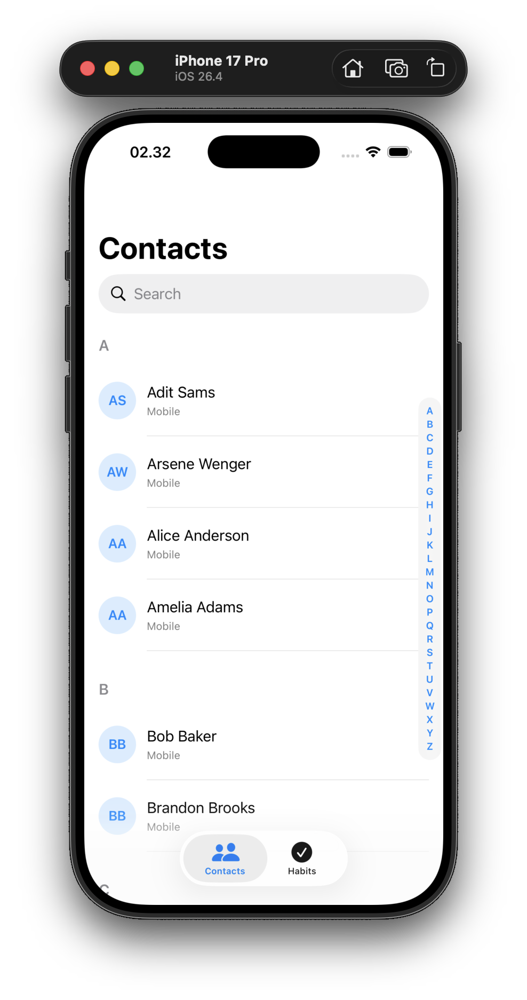
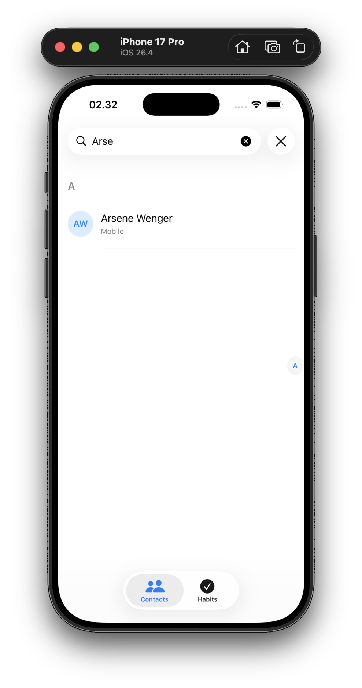
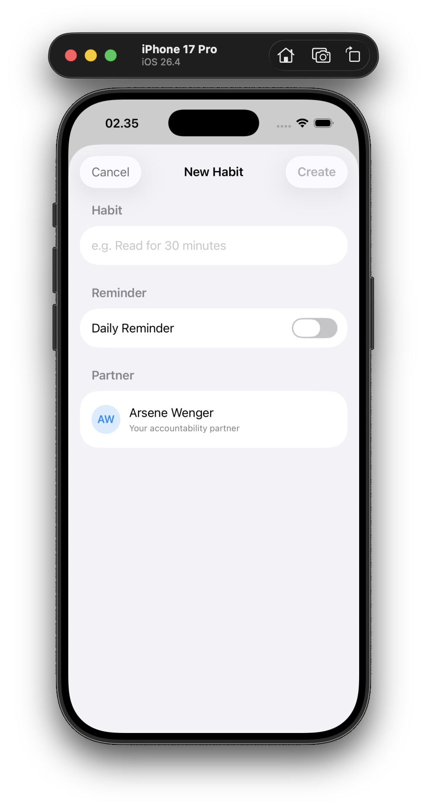
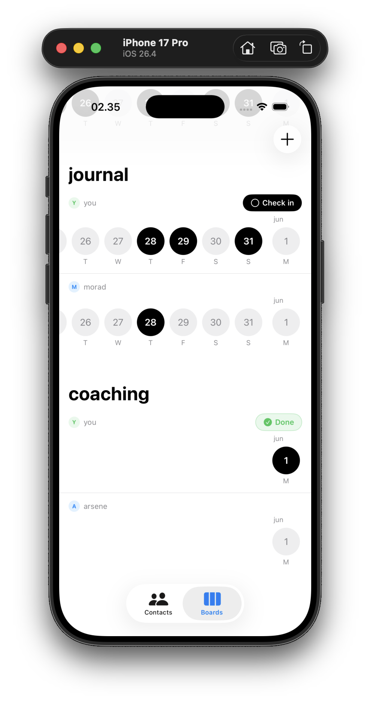

# 📇 Challenge 2 — Contacts

> **Apple Developer Academy** · Challenge 2  
> *Clone Apple's Contacts app — first the hard way (static), then the smart way (dynamic with Dictionaries).*

---

## 📸 Screenshots

Below are a few screenshots from the running app. Files are located in the workspace `Resources` folder — paths are relative to this README.

<table>
    <tr>
        <td></td>
        <td></td>
        <td></td>
    </tr>
    <tr>
        <td></td>
        <td></td>
        <td></td>
    </tr>
</table>

## 📖 About

The **Contacts** challenge reproduces the look and feel of iOS's native Contacts app using SwiftUI. It is built in two distinct stages that teach a crucial lesson: **start simple, then generalise**.

| Version | File | Approach |
|---|---|---|
| **Static** | `AcademyVersion.swift` | Hardcoded contacts, hardcoded sections — fast to write, impossible to scale |
| **Dynamic** | `DictionaryViewVersion.swift` | Data-driven grouping via Swift's `Dictionary(grouping:)` — scalable and reusable |

---

## 🎯 Learning Objectives

| Concept | What you practice |
|---|---|
| `List` with `Section` | Building alphabetically sectioned lists |
| Section index (scrubber) | `.listSectionIndexVisibility(.visible)` |
| `.searchable()` | Adding a native search bar to a navigation stack |
| `Toolbar` / `ToolbarItem` | Placing buttons in the bottom bar |
| `Dictionary(grouping:)` | Grouping an array into a keyed dictionary in one line |
| `ForEach` over dictionary keys | Rendering dynamic sections from computed data |
| `@State` / computed properties | Separating data transformation from the view layer |
| SwiftUI layout (`ZStack`, `VStack`, `HStack`) | Composing avatar + name rows |

---

## 🗂️ Project Structure

```
AppleAcademy-Ch2-Contacts/
├── Contacts.xcodeproj/            # Xcode project file
└── Contacts/
    ├── MainApp.swift              # @main entry point → shows StaticContactsView
    ├── AcademyVersion.swift       # Static implementation (hardcoded data)
    ├── DictionaryViewVersion.swift# Dynamic implementation (Dictionary-powered)
    └── Assets.xcassets/
        ├── AppIcon.appiconset/
        └── AccentColor.colorset/
```

---

## 📱 Static Version — `StaticContactsView`

A pixel-faithful recreation of the iOS Contacts app with **hardcoded data**. Every contact, every section header, and every alphabet index label is manually written.

```
┌──────────────────────────────┐
│  Contacts           🔍       │  ← navigationTitle + inline search
├──────────────────────────────┤
│  ⬤ CL  Charles Leclerc      │  ← "My Card" row
│                              │
│  C                           │  ← Section header
│  ⬤ CL  Charles Leclerc      │
│                              │
│  G                           │
│  ⬤ GR  George Russell       │
├──────────────────────────────┤
│  [search]      [+]           │  ← bottom toolbar
└──────────────────────────────┘
```

**Key techniques:**
- `Circle()` + `ZStack` to create letter avatars
- `.sectionIndexLabel()` to populate the side scrubber
- `.listSectionIndexVisibility(.visible)` to always show the index
- `DefaultToolbarItem(kind: .search, placement: .bottomBar)` for native search placement

---

## 📱 Dynamic Version — `DynamicContactsView`

The same UI, but now powered by a real data array. Adding a new contact is a one-line array change — no new sections, no new headers.

```swift
let allContacts = ["Javier", "Maddie", "Bishal", "Morad",
                   "lala", "Aka", "Shiro", "Mazitala", "Stamp"]
```

Swift's `Dictionary(grouping:)` does all the heavy lifting:

```swift
var groupedContactsDictionary: [String: [String]] {
    Dictionary(grouping: allContacts) { contact in
        String(contact.prefix(1)).uppercased()   // key = first letter
    }
}
```

Result at runtime:
```
A: ["Aka"]
B: ["Bishal"]
J: ["Javier"]
L: ["lala"]
M: ["Maddie", "Morad", "Mazitala"]
S: ["Shiro", "Stamp"]
```

The view then iterates over `sectionHeaders` (sorted keys) with a `ForEach`, producing fully dynamic alphabetical sections — no manual maintenance required.

---

## 🔑 Key Code Snippets

### Avatar circle (Static)
```swift
ZStack {
    Circle()
        .frame(width: 60, height: 60)
        .foregroundColor(.gray)
    Text("CL")   // initials
}
```

### Dictionary grouping (Dynamic)
```swift
Dictionary(grouping: allContacts) { String($0.prefix(1)).uppercased() }
```

### Dynamic section rendering
```swift
ForEach(sectionHeaders, id: \.self) { header in
    Section(header: Text(header)) {
        ForEach(groupedContactsDictionary[header]!.sorted(), id: \.self) { contact in
            HStack {
                Image(systemName: "person.fill").foregroundColor(.blue)
                Text(contact)
            }
        }
    }
}
```

---

## 🚀 How to Run

1. Open `Contacts.xcodeproj` in **Xcode 15+**
2. Select any iPhone simulator (e.g. *iPhone 16*)
3. Press **⌘ R** — the app launches with `StaticContactsView`
4. To preview the dynamic version, open `DictionaryViewVersion.swift` and use the **#Preview** canvas

---

## 🛠️ Tech Stack

- **Language:** Swift 5.9+
- **UI Framework:** SwiftUI
- **Minimum Deployment:** iOS 17+
- **Xcode:** 15+

---

## 👥 Contributors

| Name | Role |
|---|---|
| Mohamed Morad | Dynamic view (`DictionaryViewVersion.swift`), App entry point |
| Javier Fransiscus | Static view (`AcademyVersion.swift`) |

---

*Apple Developer Academy · Challenge 2*

